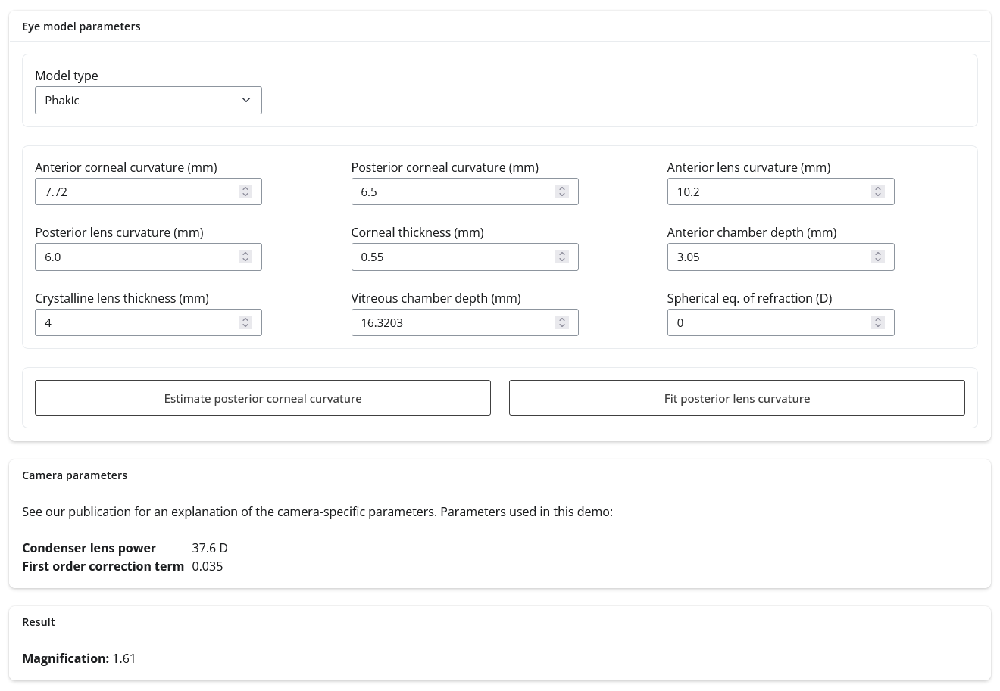

# PARaxial Optical fundus Scaling (PAROS)

Paros is a method to calculate the magnification of fundus images based on the optical characteristics of the patient's eye. The full method and validation are described in Pors LJ, Haasjes C, van Vught L, et al. Correction Method for Optical Scaling of Fundoscopy Images: Development, Validation, and First Implementation. Invest Ophthalmol Vis Sci. 2024;65(1):43. [doi:10.1167/iovs.65.1.43](https://iovs.arvojournals.org/article.aspx?articleid=2793314)

## License

The code is provided as is, without any warranty, under the [MIT license](LICENSE). This license requires that reusers give credit to the creator. It allows reusers to distribute, remix, adapt, and build upon the material in any medium or format. 

## Basic usage

### Try it online
A basic version of PAROS can most easily be run online here: [basic version](https://demo.mreye.nl/PAROS)

[](https://demo.mreye.nl/PAROS)

### Install the library

The full package is also available on [PyPI](https://pypi.org/project/PAROS):

```
pip install PAROS
``` 

PAROS consists of two main functions: 

- `fundus_camera_calibration.ipynb`: a method to calibrate camera using eye phantom measurements. 
- `calculate_ocular_magnification.ipynb`: a method to calculate magnification fundus images of a subject. 

## Implementation 

The implementation of PAROS in this repository is functional for the camera in our center, and with the specific software used at our center. Both have impact on the calculated magnification. We therefore recommend calibration of the camera and software using the method described in the article mentioned below before implementation for quantitative purposes.

## Camera constants

Please find here a table of known camera calibration constants; this can be added upon by other contributors. 
| Camera type     | CCD type | Condenser lens power (D) | First order calibration term |
| --------------- | -------- | ------------------------ | ---------------------------- |
| Topcon TRC-50DX |          | 38.0                     | -0.011                       |
| Topcon TRC-50IX |          | 38.0                     | -0.012                       |

## Referencing

When publishing results obtained with this package, please cite the paper that describes the full method and validation: Pors LJ, Haasjes C, van Vught L, et al. Correction Method for Optical Scaling of Fundoscopy Images: Development, Validation, and First Implementation. Invest Ophthalmol Vis Sci. 2024;65(1):43. [doi:10.1167/iovs.65.1.43](https://iovs.arvojournals.org/article.aspx?articleid=2793314)

## Contributing

Please read our [contribution guidelines](CONTRIBUTING.md) prior to opening a Pull Request.

## Contact

Feel free to contact us for any inquiries:

- L.J. Pors ([email](mailto:l.j.pors@lumc.nl))
- J.W.M. Beenakker ([email](mailto:j.w.m.beenakker@lumc.nl))
