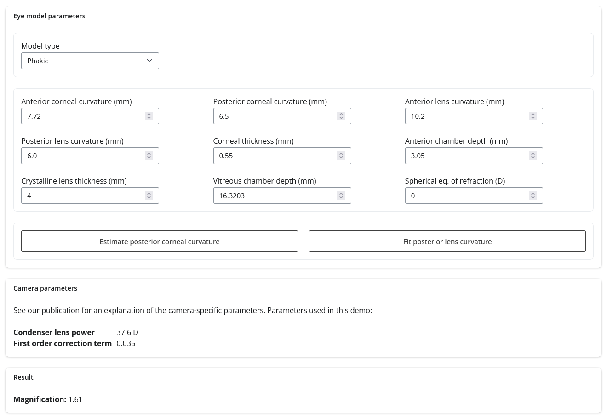

# PARaxial Optical fundus Scaling (PAROS)

Paros is a method to calculate the magnification of fundus images based on the optical characteristics of the patient's eye. The full method and validation are described in Pors LJ, Haasjes C, van Vught L, et al. Correction Method for Optical Scaling of Fundoscopy Images: Development, Validation, and First Implementation. Invest Ophthalmol Vis Sci. 2024;65(1):43. [doi:10.1167/iovs.65.1.43](https://iovs.arvojournals.org/article.aspx?articleid=2793314)

## License

The code is provided as is, without any warranty, under the [MIT license](LICENSE).
This license requires users to acknowledge the original creator. It permits others to share, modify, adapt, and build upon the material in any medium or format, as long as the copyright notice and license are included in all copies or substantial portions of the software. 

If you used this code for your research, please cite the original article mentioned above.

## Basic usage

### Try it online

A basic version of PAROS can most easily be run online here: [basic version](https://demo.mreye.nl/paros)

[](https://demo.mreye.nl/PAROS)

### Install the library

The full package is also available on [PyPI](https://pypi.org/project/PAROS):

```
pip install PAROS
``` 

PAROS has two main functions:

1. **Calibration of fundus cameras using eye phantom measurements.** This application is demonstrated in the [`fundus_camera_calibration.ipynb`](examples/fundus_camera_calibration.ipynb) notebook.
2. **Calculation of ocular magnification of fundus images.** This application is demonstrated in the [`calculate_ocular_magnification.ipynb`](examples/calculate_ocular_magnification.ipynb) notebook.

## Implementation 

The implementation of PAROS in this repository is functional for the camera in our center, and with the specific software used at our center. Both have impact on the calculated magnification. We therefore recommend calibration of the camera and software using the method described in the article mentioned below before implementation for quantitative purposes.

## Eye model

PAROS' eye model is based on the Escudero-Sanz and Navarro wide-angle schematic eye[^navarro].
Since PAROS is a paraxial method, asphericities and retinal shapes are not taken into account.

## Camera models

PAROS defines three camera models: a simplified paraxial model, a telecentric model and a focus-dependent model.

### Paraxial model

The paraxial model is the model used for the original implementation of PAROS described in the article mentioned above.
This model works well for some classical fundus cameras, but appears to be unreliable for some other cameras, especially for cameras with a telecentric design.

The table below lists known camera calibration constants; this can be added upon by other contributors. 

| Camera type     | CCD type | Condenser lens power [D] | First order calibration term | Pixel density [px/mm] |
| :-------------- | -------- | -----------------------: | ---------------------------: | --------------------: |
| Topcon TRC-50DX |          | 37.6                     | 0.03481                      | 100                   |
| Topcon TRC-50IX |          | 37.7                     | 0.03226                      | 100                   |

> [!NOTE]
> The pixel density for the Topcon system is estimated.
> Since this value is only used to fit the other parameters, it does not need to be exact, but the same value should be used for both calibration and magnification calculation.

### Telecentric model

The telecentric design of a fundus camera results in a linear relationship between the eccentricity of the incoming ray and the corresponding position on the sensor.
The telecentric camera model uses this relation to calculate the magnification from ray angles.
The derivation of the magnification for a telecentric camera is described in [docs/telecentric-camera.md](docs/telecentric-camera.md).

### Focus-dependent model

The focus-dependent model is an extension of the telecentric model that takes into account the effect of focus on the magnification.
Since the angular magnification of this camera model depends on the focus, the camera is not telecentric in the strict sense.

## Referencing

When publishing results obtained with this package, please cite the paper that describes the full method and validation: Pors LJ, Haasjes C, van Vught L, et al. Correction Method for Optical Scaling of Fundoscopy Images: Development, Validation, and First Implementation. Invest Ophthalmol Vis Sci. 2024;65(1):43. [doi:10.1167/iovs.65.1.43](https://iovs.arvojournals.org/article.aspx?articleid=2793314)

## Contributing

Please read our [contribution guidelines](CONTRIBUTING.md) prior to opening a Pull Request.

## Contact

Feel free to contact us for any inquiries:

- J.W.M. Beenakker ([email](mailto:j.w.m.beenakker@lumc.nl))

Or visit [our website](https://mreye.nl) to discover our more of our research.

[//]: ## (References)
[^navarro]: Escudero-Sanz, I., & Navarro, R. (1999). Off-axis aberrations of a wide-angle schematic eye model. JOSA A, 16(8), 1881–1891. https://doi.org/10.1364/JOSAA.16.001881